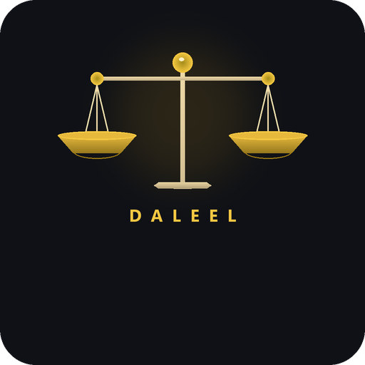

<p align="center">
  
</p>

<h1 align="center">Daleel</h1>

<p align="center">
  <strong>AI-Powered Legal Assistant for Jordanian Labor Law</strong><br>
  Graduation Project — Tafila Technical University, 2025–2026
</p>

<p align="center">
  
  
  
  
  
</p>

---

## What is Daleel?

**Daleel** (دليل) is an AI legal assistant that answers questions about the **Jordanian Labor Law No. 8 of 1996** in Arabic. It uses Retrieval-Augmented Generation (RAG) to ground every answer in the actual text of the law — no hallucinations, every answer cites exact article numbers.

Ask a question like *"ما هي حقوقي إذا تم فصلي بعد 7 سنوات؟"* and Daleel retrieves the relevant articles, court rulings, and regulations, then generates a clear Arabic answer like a knowledgeable lawyer would.

---

## Key Features

| Feature | Description |
|---|---|
| Arabic RAG Chatbot | Understands Arabic legal questions and retrieves relevant law articles |
| Multi-Granularity Retrieval | Searches at article, paragraph, and sub-paragraph levels simultaneously |
| Citation Grounding | Every answer cites exact article numbers; full sources shown below each response |
| Court Rulings | 40+ court rulings linked to specific articles and integrated into answers |
| Knowledge Graph | Articles, regulations, and rulings connected via Neo4j graph |
| Lawyer Portal | Lawyers register, get verified by admin, and upload private legal documents |
| Personalized RAG | Searches public law + lawyer's private documents together |
| Admin Dashboard | Manage lawyer verifications and system oversight |
| Off-topic Detection | Gracefully handles greetings and non-legal questions |
| Branded UI | Custom splash screen, dark theme, Arabic RTL layout |

---

## Architecture

```
                        User (Arabic question)
                               |
                               v
                     Flask Web App (app.py)
                               |
                               v
                    RAG Engine (chatbot.py)
                       /       |       \
                      v        v        v
               Qdrant DB   Neo4j     Lawyer's
              (442 vectors) (Graph)  Private Docs
                      \        |       /
                       v       v      v
                  Context Builder (3200 tokens)
                               |
                               v
                LLM — LLaMA 3.3 70B (Groq API)
                               |
                               v
                Arabic Answer + Article Citations
```

### Data Pipeline

```
labor_law.txt (142 articles) + 14 regulations + 40+ court rulings
    |
    v  parse_law_tree.py — RTL word-level coordinate sorting
    v  flatten_to_chunks.py — multi-granularity indexing
    v  embed_and_index.py — multilingual-e5-large (1024-dim vectors)
    v  build_graph.py — Neo4j knowledge graph
    |
    v
Qdrant: 442 vectors | Neo4j: articles <-> rulings <-> regulations
```

---

## Tech Stack

| Component | Technology |
|---|---|
| Backend | Python, Flask |
| Embedding Model | intfloat/multilingual-e5-large (1024-dim) |
| Vector Database | Qdrant |
| Knowledge Graph | Neo4j |
| LLM | LLaMA-3.3-70B via Groq API |
| Frontend | HTML, CSS, JavaScript (Arabic RTL, dark theme) |
| Containerization | Docker, Docker Compose |

---

## Retrieval Performance

All test queries pass at scores between **0.81–0.88** (threshold: 0.70):

| Query | Top Match | Score |
|---|---|---|
| ما هي مكافأة نهاية الخدمة | المادة 32 | 0.87 |
| الفصل التعسفي | المادة 25 | 0.81 |
| ساعات العمل والإجازات | المادة 56 | 0.86 |
| عقد العمل المحدد المدة | المادة 40 | 0.88 |
| ترك العمل دون اشعار | المادة 29 | 0.84 |
| عمل الأحداث | المادة 76 | 0.85 |

---

## Project Structure

```
daleel/
├── app.py                          Flask web server
├── chatbot.py                      RAG + LLM engine
├── shared_model.py                 Shared embedding model
├── run_retrieval_pipeline.py       Pipeline orchestrator
├── requirements.txt                Dependencies
├── Dockerfile                      Container build
├── docker-compose.yml              Multi-service orchestration
│
├── pipeline/                       RAG data pipeline
│   ├── parse_law_tree.py           Arabic text → hierarchical tree (RTL fix)
│   ├── flatten_to_chunks.py        Tree → multi-granularity chunks
│   ├── embed_and_index.py          Chunks → Qdrant vectors
│   ├── build_graph.py              Neo4j knowledge graph
│   ├── ingest_rulings.py           Court rulings ingestion
│   ├── summarize_rulings.py        LLM ruling summarization
│   ├── merge_law_system.py         Law + regulations fusion
│   └── preprocess_regulations.py   Regulation processing
│
├── auth/                           Authentication & roles
├── admin/                          Admin dashboard
├── lawyer/                         Lawyer verification & doc upload
│
├── data/                           Legal dataset
│   ├── labor_law.txt               Full law (142 articles)
│   ├── reg_*.txt                   14 labor regulations
│   ├── rulings/                    40+ court rulings
│   └── legislation_links/          Article cross-references
│
├── templates/                      Frontend
│   ├── index.html                  Chat interface (Arabic RTL, dark theme)
│   ├── auth/                       Login & registration pages
│   ├── admin/                      Admin panel
│   └── lawyer/                     Lawyer dashboard
│
└── static/                         Logo & assets
```

---

## Team

| Name | Role |
|---|---|
| **Omar Al-Haymoni** | Lead Developer |
| **Hasan Al-Omari** | Developer |
| **Abdullah Al-Khawaldeh** | Developer |
| **Mohammad Al-Masri** | Developer |
| **Dr. Jamil Al-Sawwa** | Supervisor |

Tafila Technical University — Second Semester 2025–2026

---

## License

This project is licensed under the [MIT License](LICENSE).
The Jordanian Labor Law text is public domain.
